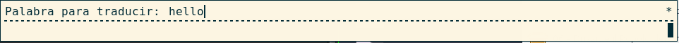
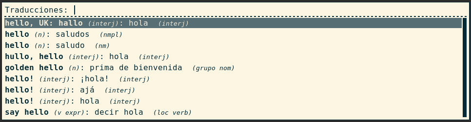

# WR-translator
A script to quickly translate words from/to english to your native language and vice versa inside Rofi launcher.

# Disclaimer
I am by no means a Python guru. The code can be improved for sure in some ways.

This is a home-made project I did to have quick access to translations from english to italian (my own language), and was further extended to support the main other languages available on Wordreference.

Feel free to fork, modify and suggest improvements.

**No guarantees on keeping this project up to date are given** as this is done during my free time.

# Requirements

  + Rofi
  + Python 3
  + BeautifulSoup 4

# Usage
The script takes as input 3 parameters:

  + *Language Interface*: it, en, fr, es, de
  + *Source Language*: it, en, fr, es, de
  + *Target Language:* en (if it/fr/es/de is chosen) or it/fr/es/de (if en is chosen)

You can translate quickly, using **Rofi**, any word in the given language to the other target language.

# Examples
**Translate from spanish to english, spanish interface language:**

    python3 wordreference.py es es en

And after you press Return:

**Translate from italian to spanish, italian interface language:**

    python3 wordreference.py it it es

This prints the help message because *non-english to non-english* language translation is not supported:

    usage: wordreference.py [-h] {en,it,es,fr,de} {en,it,es,fr,de} {en,it,es,fr,de}

    This is used to get a quick translation from italian, french or spanish to
    english OR viceversa. NOTE: translation from non-english to non-english or
    from same-language to same-language is forbidden

    positional arguments:
      {en,it,es,fr,de}  Interface language
      {en,it,es,fr,de}  Source translation language
      {en,it,es,fr,de}  Target translation language

    optional arguments:
      -h, --help     show this help message and exit
